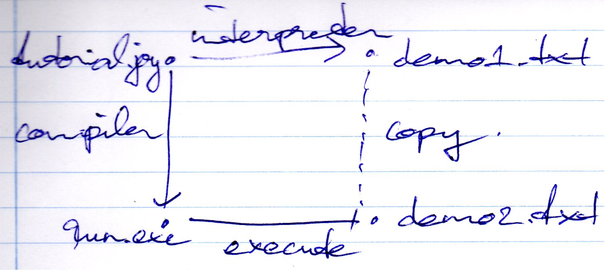

Coy
---

Build|Linux|Windows|Coverage
---|---|---|---
status|||

This is a reimplementation of [42minjoy](https://github.com/Wodan58/42minjoy).
This project depends on the [BDW garbage collector](https://github.com/ivmai/bdwgc).

Installation
------------

The BDW garbage collector has to be installed as well as CMake. Then run:

CMake -G "Unix Makefiles"

make

Additions
---------

In addition to normal interpreter mode, this program offers a -c option that
compiles to C99.

Two output files are created, demo1.txt and demo2.txt and they are identical.

Adding a builtin, e.g. SELECT requires modification of the program in 5
separate locations.

