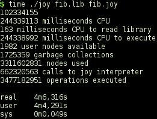
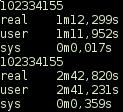
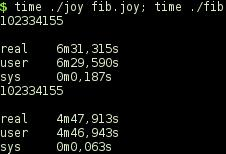
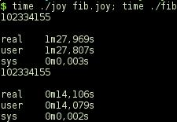

 
==============

Introduction
============

Voy is a reimplementation of 42minjoy that itself is a conversion from the
original Pascal program. 

Implementation
==============

The implementation uses vectors (Judy arrays) instead of linked lists and does
not use runtime type information.

Datatypes
---------

This reduced version does not have all datatypes of full Joy. The ones that are
used are: USR, ANON_FUNCT, BOOLEAN, CHAR, INTEGER, LIST, SYMBOL. The ones that
are missing are: SET, STRING, FLOAT, FILE.

SYMBOL occurs in the compiled program instead of USR; USR is index to the
symbol table and although there is a symbol table in the compiled program,
SYMBOL does not index that table.

Without runtime type information, there is some trouble distinguishing the
various datatypes and the interpreter differs from the compiled program: LIST
is flagged with the low order bit set to one, making the address odd. As it
happens, SYMBOL can also be stored at an odd address and that causes
difficulties when trying to distinguish between the two. The solution in that
case is not to rely on the automatic output at the end of the program, but
instead specify exactly what to expect when printing.

Ok, the automatic output has been restored. SYMBOL occurs between program start
and program end. By testing that range, it is possible to print strings
correctly after all.

What remains are INTEGER larger than SMALLINT, BOOLEAN, and CHAR. They need a
datatype specific printing procedure. The same applies to SET, STRING, FLOAT,
and FILE if they are added as a datatype.

Builtins
--------

Two of the builtins, `get` and `body`, are supposed to be executed at compile
time and are not part of the compiler output. The `execute` function pushes
values on the stack and calls builtins.

Lexical analysis
----------------

The lexical analyser faithfully records the type of what was read. This type is
then ignored by the parser. Noteworthy is that the function that reads
characters calls *exit*, at end of file. This means that all further processing
must have been registered with *atexit*.

Parser
------

The parser stores builtins and defined symbols in the symbol table and dumps
the symbol table, when requested. The parser calls `execute` whenever a program
has been read.

Main
----

The task of *main* is to read command line parameters and to call the parser.
It is possible to trace the execution of the program, but only when the program
has been compiled with -DTRACE_EXECUTE and the program was started with `-d`.

Print
-----

At the end of a program, the top of the stack is popped *and in addition to
that*, the top of the stack is printed. The *in addition* shows that output is
a side-effect.
The automatic printing of the top value is possible, as long as there are no
large integers on the stack. If there are, they must be printed with `put_int`,
because otherwise they are mistaken for lists or symbols and the program will
crash. Booleans and characters also require their own printing or they will be
printed as integers.

Compiler
--------

The compile function is embedded in builtin.c, because the decision of what to
compile is left to each of the builtins. Generally, if there are enough
parameters on the stack builtins will execute at compile time; if not, the
stack will be compiled as well as the builtin. Some builtins, the ones that
produce output, will always be compiled. Noteworthy is also `unstack`, because
it is interpreted as well as compiled. It must be, because it changes to
another stack and the runtime must know about that.

Additions
---------

There will always be the need to add new builtins and/or datatypes. New
builtins are added to builtin.c, builtin.h, function initsym in symbol.c and if
they contain special characters they are also added to the function identifier
in builtin.c. New datatypes require some more work.

Performance
===========

The aim is to have overall good performance. It is nice when the slow Fibonacci
function is executed almost as fast as when the algorithm was programmed
directly in C, but testing does not stop there. The other example programs must
also perform well. That is why Judy arrays were selected. The way that memory
is handled is the determining factor of program speed; the amount of
instructions needed is insignificant.

Comparison
----------

A comparison of three different programs. 42minjoy has a lot of garbage
collections; Coy uses a typed stack and does not precompute any values; Voy
uses a Judy array as stack and precomputes part of the result. Both Coy and Voy
have an interpreter mode and a compile mode. The compiled programs are faster.

 

42minjoy. %STATISTICS is on, showing whatever it can about performance
indicators.

 

Coy, interpreted and compiled. The compiled version is slower, because it
constantly recreates the same lists over and over. This was repaired in Voy,
not in Coy.

 

Voy, interpreted and compiled. The compiled version is slower than 42minjoy,
even though part of the computation has already been done at compile time. This
must mean that implementing the stack as a Judy array is not such a good idea.
Maybe all vectors can be just that: vectors.

 

Voy, interpreted and compiled. The stack has been implemented with vector.h;
the symbol table is implemented with khash.h, so Judy arrays are not used after
all.
